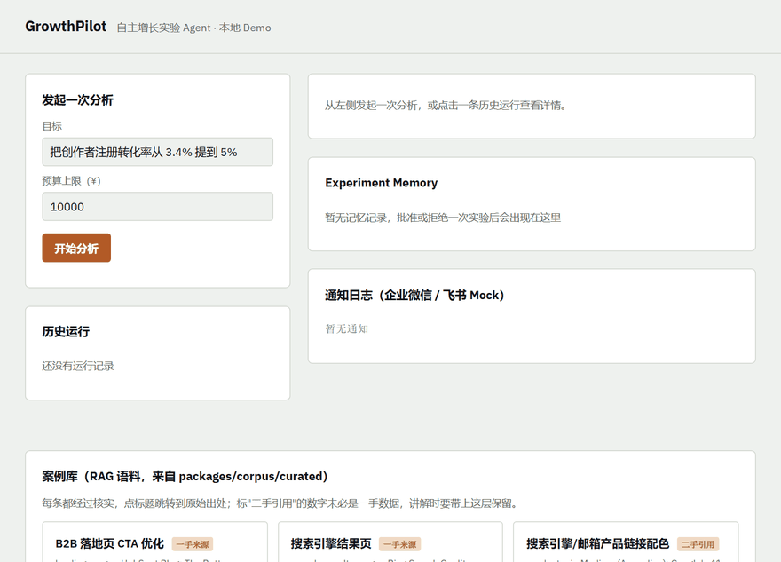
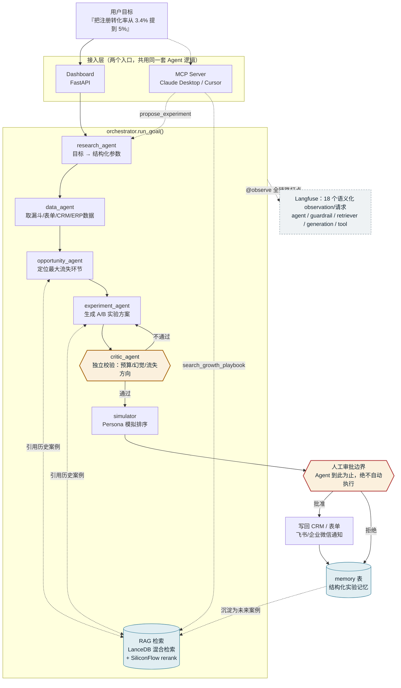

# GrowthPilot

自主增长实验 Agent：给一个目标，它从数据里找机会点、生成实验假设、模拟排序、走人工审批，批准后写回原系统，并把结论存进长期记忆。

面向中国企业场景：企业微信 / 飞书 / CRM / ERP / 表单 / 官网埋点，而不是 HubSpot + GA4 那一套海外栈。



*目标输入 → RAG 检索到的历史案例引用（可点击跳转真实来源）→ Critic 校验 → Persona 模拟 → 人工审批 → 案例库*

## 架构



**图上两个特殊节点是整个架构的核心**：`critic_agent`（黄色菱形）是独立于生成方的校验层，
`人工审批边界`（红色菱形）是任何接口——包括 MCP——都无法绕过的强制人工确认点，
详见 [INTERVIEW_GUIDE.md](docs/INTERVIEW_GUIDE.md) 决策 #1。

详细文档：
- [docs/PROJECT_STRUCTURE.md](docs/PROJECT_STRUCTURE.md) — 目录结构与分层职责
- [docs/API_AND_MATERIALS.md](docs/API_AND_MATERIALS.md) — API 清单与接入优先级
- [docs/TECH_STACK.md](docs/TECH_STACK.md) — 技术选型记录，含真实 A/B 测试数据和踩坑记录
- [docs/HARNESS_DESIGN.md](docs/HARNESS_DESIGN.md) — 三层 harness 架构对齐 *Code as Agent Harness* 论文，含一个诚实的架构发现
- [docs/DEPLOYMENT.md](docs/DEPLOYMENT.md) — Zeabur 部署配置与已知限制
- [docs/DEVELOPMENT_PLAN.md](docs/DEVELOPMENT_PLAN.md) — 分阶段路线图（早期规划稿）
- [docs/INTERVIEW_GUIDE.md](docs/INTERVIEW_GUIDE.md) — 面试讲解稿
- [apps/mcp-server/README.md](apps/mcp-server/README.md) — MCP Server 工具清单与设计边界

## 当前实现状态

这是一个**可本地运行的 MVP**，每一个外部系统都做成了可插拔接口（`app/tools/*`、`app/llm/*`）：
没有配置真实密钥时，自动用 Mock 实现（本地生成合成数据、审批走 Dashboard 按钮而不是真的飞书 UI）；
一旦在 `.env` 里填上真实密钥，`get_*_tool()` 工厂函数会自动切换到对应的 `Real*` 实现，Agent 代码本身不用改一行。

| 系统 | Mock（今天能跑） | Real（留好接口） |
|---|---|---|
| LLM | `MockLLM`：模板化中文叙述，零成本 | `OpenAICompatibleLLM`：接 DeepSeek / 通义千问 / GLM-4 等，只需 `LLM_BASE_URL` + `LLM_API_KEY` |
| 企业微信 | 通知落本地库 | `RealWecomTool`：真实 gettoken + message/send API |
| 飞书 | 审批状态就是本地 `runs.status`，Dashboard 按钮模拟人工审批 | `RealFeishuTool`：真实 tenant_access_token + 审批实例 API |
| CRM / ERP / 表单 / 埋点 | 合成数据（`app/tools/*.py` 里的 Mock 类） | 类已搭好骨架和 TODO，接入时新增一个 `Real*Tool` 类即可 |

## 快速开始

```bash
cd apps/agent-service
python -m pip install -r requirements.txt
python -m uvicorn app.main:app --reload --port 8000
```

打开 http://127.0.0.1:8000 ，输入一个目标（比如"把创作者注册转化率从 3.4% 提到 5%"）点"开始分析"，
走一遍 Opportunity → Experiment → Critic 校验 → Simulation → 审批 → 写回 → Memory 的完整链路。

要接真实 LLM / 企业微信 / 飞书：复制 `apps/agent-service/.env.example` 为 `.env`，填入密钥即可，无需改代码。

RAG 检索层同理是三档可插拔（Mock / SiliconFlow 托管 API / 本地 bge），`.env` 里 `EMBEDDER_PROVIDER`
/ `RERANKER_PROVIDER` 切换，见 [docs/TECH_STACK.md](docs/TECH_STACK.md)。

## 可观测性

全链路 `@observe` 打点（[Langfuse](https://cloud.langfuse.com) 免费版，`.env` 填 `LANGFUSE_PUBLIC_KEY`
/ `LANGFUSE_SECRET_KEY` / `LANGFUSE_BASE_URL` 即可，不填就静默不 trace，不影响业务逻辑）。
接上当天就用真实 trace 数据发现了一个性能问题——两次 RAG 检索占了单次请求 85% 以上的耗时，
详见 [docs/TECH_STACK.md](docs/TECH_STACK.md)。

## MCP Server

把检索和数据能力暴露成标准 MCP 工具，Claude Desktop / Cursor 等客户端可直接调用：

```bash
cd apps/mcp-server
python -m venv .venv
.venv\Scripts\pip install -r requirements.txt
.venv\Scripts\pip install lancedb==0.15.0 tantivy==0.22.0 jieba==0.42.1
run.bat
```

详见 [apps/mcp-server/README.md](apps/mcp-server/README.md)——包括为什么是独立 venv、
为什么是 HTTP transport 而不是更常见的 STDIO（一个真实挂死 bug 的排查记录）。

## 跑 Eval

```bash
cd apps/agent-service
set PYTHONPATH=.
.venv\Scripts\python ..\..\packages\eval\benchmarks.py       # Critic Baseline + Adversarial 套件 -> report.json
.venv\Scripts\python ..\..\packages\eval\retrieval_eval.py   # RAG 检索质量消融 -> retrieval_report.json
```

方法论、结果解读、发现并修复的两个真实 bug、检索消融里一个反直觉发现的排查过程，
全部写在 [docs/EVALUATION.md](docs/EVALUATION.md)，不只是甩数字。

## 目录

```
apps/agent-service/   FastAPI 后端：agents / tools / llm / rag / simulation / planner / dashboard
apps/mcp-server/       MCP Server：把检索与数据工具暴露给 Claude Desktop 等 MCP 客户端
packages/eval/         合成数据生成 + 基准测试
packages/corpus/       RAG 语料（增长案例知识库）
docs/                   架构、API 清单、技术选型、开发计划、面试指南
```
